# ProjectX

### Descripción del proyecto

Project X es un proyecto profundiza dentro del insólito mundo de las *Dark Stories*. Para aquellos que buscan *stories* únicas y paranormales, esta es su plataforma.

Un usuario dentro de esta Project X podrá intendar dar sentido resolviendo diversas Dark Stories propuestas por otros usuarios o, incluso, tendrá la posibilidad de manifestar su creatividad proponiendo *stories* propia.

### Descripción técnica del proyecto

Para el almacenamiento de los datos se usará [neo4j](https://neo4j.com/). Esta base de datos basada en grafos se desplegará dentro de un servidor de Microsoft Azure. El objetivo, es crear un servidor en el que por cada usuario se almacenarán las distintas historias y pistas para resolverlas. Además, se tendrá que llevar un control a la hora de la interacción entre usuarios.

Una vez montada la infraestructura, para el diseño de la web se usará *python* se usará libreria *beatutiful soup*, que "une" *python* con *HTML*.

### Despliegue en Heroku

Nos abrimos cuenta en Heroku, y conectamos con nuestro github.

Despliegue https://projectxguillesiesta.herokuapp.com/

### Despliegue en Docker

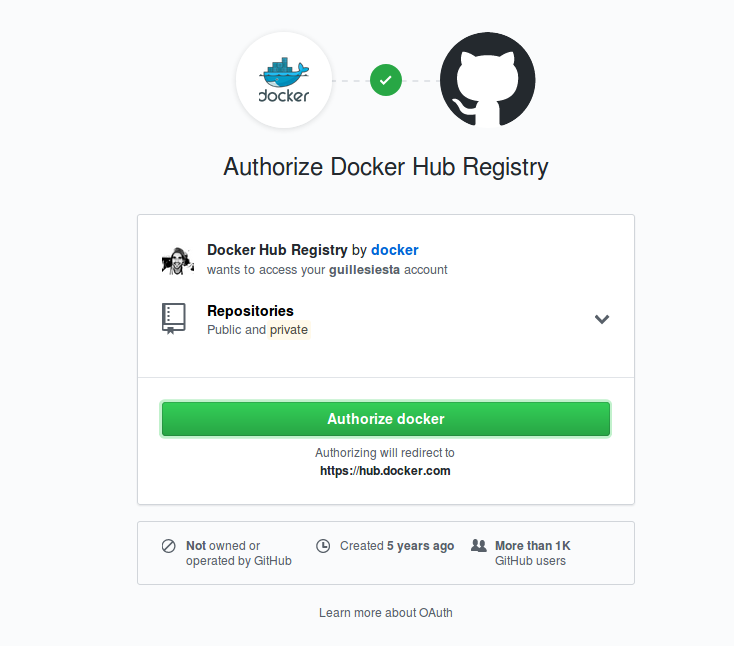
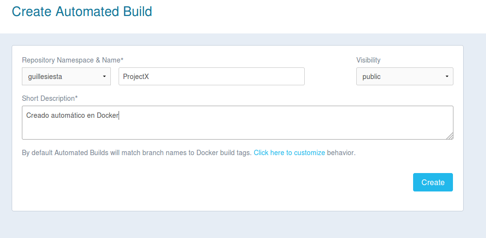
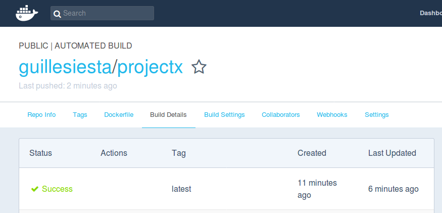
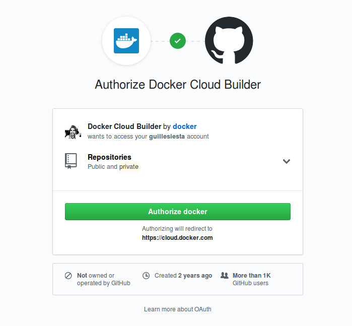
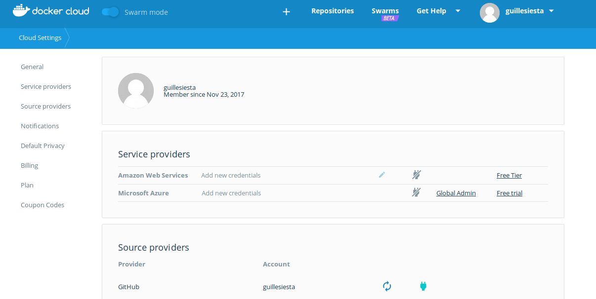
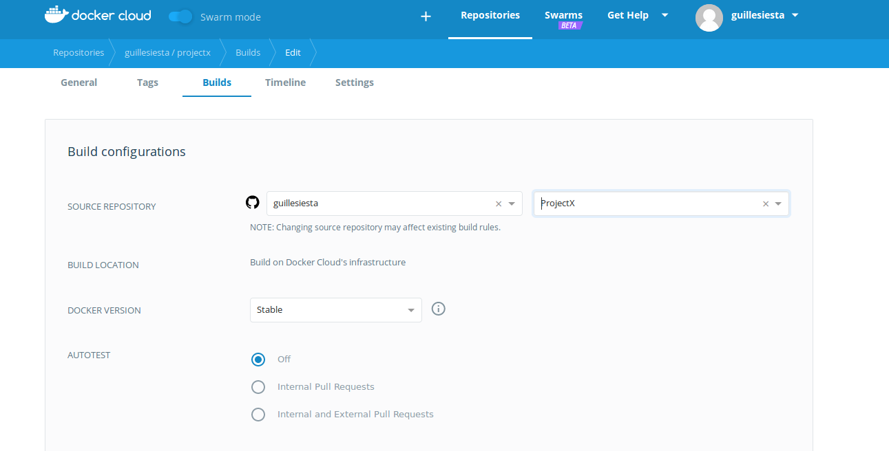

[Enlace a DockerHub](https://hub.docker.com/r/guillesiesta/projectx/)

Enlace del repositorio en Docker Hub:  https://hub.docker.com/r/guillesiesta/projectx/

### Despliegue en Zeit

Instalo [nvm](https://www.liquidweb.com/kb/how-to-install-nvm-node-version-manager-for-node-js-on-ubuntu-12-04-lts/)

Descargo now: npm install -g now

Me voy a la carpeta donde tengo mi proyecto y ejecuto: now --public

Contenedor: https://projectx-ppcjlcvsoh.now.sh/

### Despliegue en Azure

Gracias al cun proporcionado por el profesor he podido desplegar el proyecto correctamente. 

Pasos:

1.- Crear una aplicación basada en linux

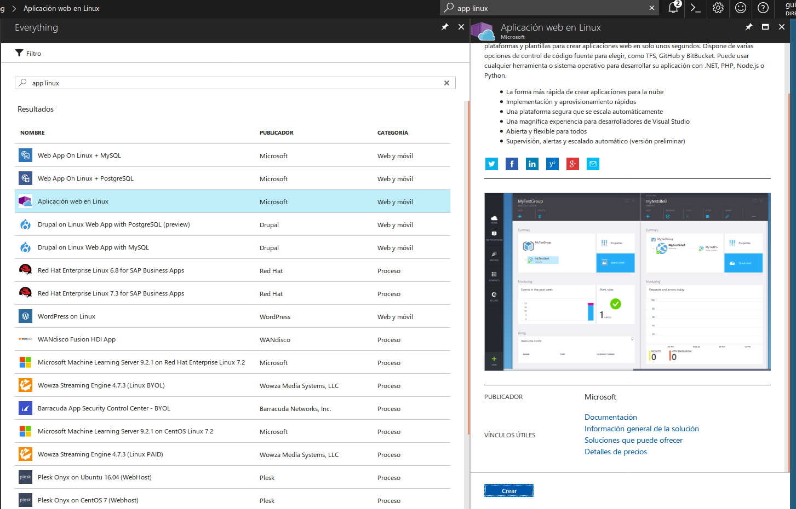

2.- Una vez creada enlazamos con nuestra imagen de DockerHub

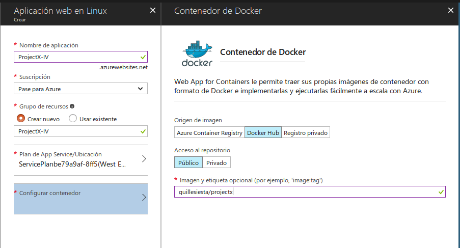

3.- Si todo funciona correctamente obtendremos lo siguiente:

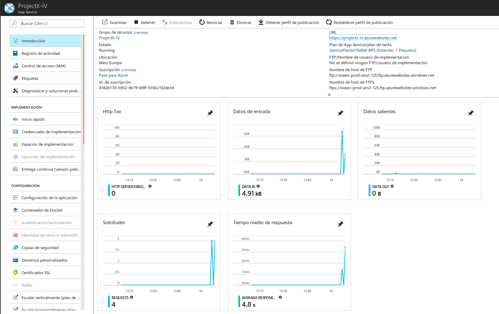

Despliegue https://projectx-iv.azurewebsites.net/

### Despliegue en un IaaS

La aplicación la desplegué en Azure. Usaré Vagrant como herramienta para la creación de la máquina virtual dónde se alojará mi aplicación. Para el aprovisionamiento usaré Ansible y Fabric para instalarla y ponerla en ejecución.

Instalamos [vagrant y azure-cli](https://github.com/Azure/vagrant-azure) siguiendo este tutorial. Muy importante tener la última versión de vagrant instalada.
Instalamos el [plugin de azure en vagrant](https://github.com/softwaresaved/vagrant-azure-recomp) (previamente para linux necesitamos ejecutar npm install azure-cli -g) siguiendo este tutorial.

Archivo [Varantfile]()
Para ansible usamos archivo [var.yml]() y [playbook.yml]()

Para crear la máquina virtual

vagrant up --provider=azure

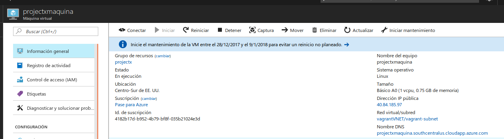

Abrimos puerto 80 de la máquina:

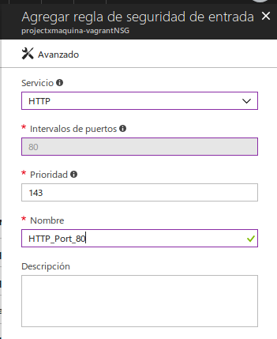

Para el despliegue voy a usar Fabric

Aquí el archivo [fabfile.py]()
